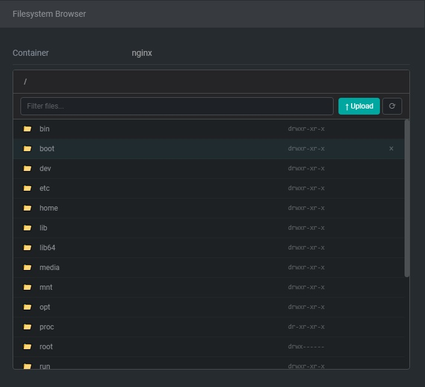
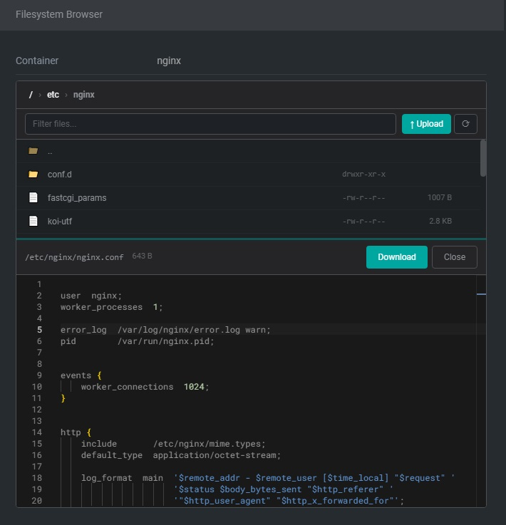
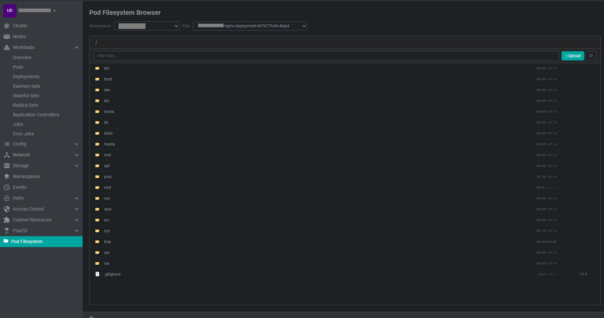

# Freelens Pod File Browser

> Stop running `kubectl exec -it pod -- cat /etc/config` 50 times a day.  
> Browse, edit, upload, and download files inside Kubernetes pods — directly from the Freelens UI.


---

**Why?** Every time you debug a pod, you run the same ritual: `kubectl exec`, `cat` a file, exit, repeat. This extension eliminates that context-switching tax by giving you a graphical file browser inside your pod view.

---

## Use Cases

- **Debugging configs** — Check nginx.conf, application.yaml, or environment files without typing paths
- **Inspecting logs** — Browse `/var/log` directories, open log files with syntax highlighting
- **Fixing containers** — Upload corrected config files via drag-and-drop instead of `kubectl cp`
- **Verifying deployments** — Confirm files were written correctly after a deploy
- **Exploring unknown containers** — See the full filesystem layout at a glance

## Features

- **Directory browsing** — Navigate pod filesystems with a flat file listing and clickable breadcrumb bar
- **File viewing & editing** — Open files in a Monaco editor with syntax highlighting; edit and save changes back to the pod
- **Upload files** — Upload local files to the pod via button or drag-and-drop (max 1 MB)
- **Download files** — Download any file from the pod to your local machine
- **Delete files/directories** — Remove files or directories with a confirmation dialog
- **Binary file detection** — Automatically detects binary files and shows a download-only placeholder instead of the editor
- **Symlink resolution** — Displays symlink targets inline in the file listing
- **Context menu** — Right-click entries for quick access to Open, Download, Copy Path, and Delete
- **Container selector** — Switch between containers (including init containers) within a pod
- **Search/filter** — Filter files by name within the current directory
- **Permissions display** — Shows file permissions, sizes, and types parsed from `ls -la` output
- **Split-panel layout** — File tree on top, editor on bottom; works in both the pod detail panel and the dedicated cluster page
- **Cluster page** — Full-page file browser with namespace, pod, and container selectors

## Screenshots

### Directory Browser
Browse the pod filesystem with breadcrumb navigation, permissions display, file filtering, and upload support.



### File Editor
View and edit files with syntax highlighting powered by Monaco editor. Split-panel layout with file tree on top and editor on bottom.



### Cluster Page
Dedicated full-page file browser with namespace and pod selectors, accessible from the Freelens sidebar.



## Installation

### From npm

1. Open Freelens
2. Go to **Extensions** (Ctrl+Shift+E)
3. Enter the package name in the input field:
   ```
   @masoudei/freelens-pod-filebrowser
   ```
4. Click **Install**

### From GitHub Release

1. Download the latest `.tgz` from the [Releases](https://github.com/masoudei/freelens-pod-filebrowser/releases) page
2. Open Freelens
3. Go to **Extensions** (Ctrl+Shift+E)
4. Drag the `.tgz` file into the extensions panel or use the file picker

### From Source

```bash
git clone https://github.com/masoudei/freelens-pod-filebrowser.git
cd freelens-pod-filebrowser
pnpm install
pnpm build:force
pnpm pack
```

Then load the generated `.tgz` file in Freelens as described above.

## Usage

### Pod Detail Panel

1. Navigate to any pod in Freelens
2. Open the pod details drawer
3. Scroll to the **Filesystem Browser** section
4. Select a container and start browsing

### Cluster Page

1. Open the Freelens sidebar
2. Click **Pod Filesystem** in the menu
3. Select a namespace, pod, and container from the dropdowns

### Keyboard & Mouse

| Action | How |
|--------|-----|
| Open file/directory | Click the entry |
| Navigate up | Click `..` or a breadcrumb segment |
| Right-click menu | Right-click any file entry |
| Upload files | Click the Upload button, or drag & drop files onto the file list |
| Filter files | Type in the filter input above the file list |
| Refresh | Click the refresh button in the toolbar |

## Requirements

- [Freelens](https://github.com/freelensapp/freelens) >= 1.5.0
- `kubectl` available on your system PATH
- The target pod must have basic shell utilities (`ls`, `cat`, `stat`, `head`, `rm`)

## How It Works

The extension uses `kubectl exec` through the Freelens proxy kubeconfig to run shell commands inside pod containers. This means:

- It uses the same authentication as your Freelens cluster connection (including EKS SSO, etc.)
- No direct Kubernetes API calls — just standard shell utilities
- File content is transferred as base64 for uploads, and raw text for reads
- Binary detection uses file extension matching + null byte detection in the first 512 bytes

## Development

```bash
pnpm install          # Install dependencies
pnpm build            # Compile (with type checking)
pnpm build:force      # Compile (skip type checking)
pnpm pack             # Create installable .tgz
pnpm pack:dev         # Build + pack in one step
pnpm type:check       # Type checking only
pnpm clean            # Remove build output
pnpm clean:all        # Remove build output, node_modules, and .tgz files
```

### Project Structure

```
freelens-pod-filebrowser/
├── package.json              # Extension manifest
├── tsconfig.json             # TypeScript configuration
├── electron.vite.config.js   # Build configuration
└── src/
    ├── main/
    │   └── index.ts          # IPC handlers (kubectl exec commands)
    └── renderer/
        ├── index.tsx          # Extension registration
        ├── components/
        │   ├── pod-fs-details.tsx    # Pod detail panel integration
        │   ├── pod-fs-page.tsx       # Full-page cluster page
        │   ├── file-tree.tsx         # File listing, breadcrumb, upload, context menu
        │   ├── file-viewer.tsx       # Monaco editor / binary placeholder
        │   └── pod-fs-icon.tsx       # Extension icon
        └── styles/
            └── pod-fs.module.scss    # Scoped styles (CSS Modules)
```

## Contributing

Contributions are welcome! Please feel free to submit a Pull Request.

1. Fork the repository
2. Create your feature branch (`git checkout -b feature/my-feature`)
3. Commit your changes (`git commit -m 'Add my feature'`)
4. Push to the branch (`git push origin feature/my-feature`)
5. Open a Pull Request

## Limitations

- **Upload cap**: 1 MB maximum per file
- **Shell requirements**: Pods need `ls`, `cat`, `stat`, `head`, `rm` (present in most images)
- **No recursive upload**: Directory upload not yet supported
- **No multi-file select**: Upload one file at a time
- **Freelens only**: Currently not compatible with Lens (upstream) — contributions welcome

## FAQ

**Q: Does this work with EKS / GKE / AKS / OpenShift?**  
A: Yes — it uses your existing Freelens auth. If you can see the pod in Freelens, the extension works.

**Q: Is it secure?**  
A: It inherits your existing RBAC. No new permissions are needed beyond what `kubectl exec` already uses.

**Q: Can I edit binary files?**  
A: Binary files are detected automatically (extension matching + null byte check) and shown in download-only mode.

**Q: What if my pod doesn't have `ls` or `cat`?**  
A: Distroless images may lack these utilities. The extension requires basic shell tools.

**Q: Can I contribute a Lens (upstream) version?**  
A: Yes! The extension API is similar. PRs for Lens compatibility are welcome.

## License

This project is licensed under the MIT License — see the [LICENSE](LICENSE) file for details.
